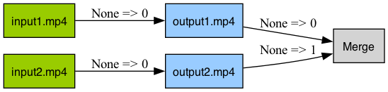
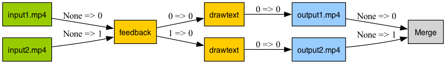

# Basic API Usage for FFmpeg

## Input

### Creating a New Input Stream
To create a new input stream, use the `ffmpeg.input` function. This function is straightforward and initiates the stream from a specified file.

```python
import ffmpeg

# Create a new input stream
input_stream = ffmpeg.input('input.mp4')
```

### Adding Input Options
To specify additional options for the input stream, such as start time and duration, you can include them directly in the `ffmpeg.input` function.

```python
import ffmpeg

# Create a new input stream with specific options
input_stream = ffmpeg.input('input.mp4', ss=10, t=20)  # Start at 10 seconds and last for 20 seconds
```

!!! note
    The `ss` option specifies the start time (in seconds), and the `t` option specifies the duration (in seconds) of the input stream. For more details, refer to the [FFmpeg documentation](https://ffmpeg.org/ffmpeg.html#Main-options).

## Output

### Creating a New Output Stream
To create a new output stream, use the `ffmpeg.output` function. This function is used to configure the output settings of the stream.

```python
import ffmpeg

# Create a new output stream
ffmpeg.input("input.mp4").output(filename="output.mp4")
```

### Specifying Output Options
You can specify various output options directly in the `ffmpeg.output` function, such as the start time and duration for the output file.

```python
import ffmpeg

# Create and configure a new output stream
ffmpeg.input("input.mp4").output(filename="output.mp4", ss=10, t=20)  # Output starting at 10 seconds with a duration of 20 seconds
```


You can also map multiple streams to a single output file.

```python
import ffmpeg

# Define input streams
input1 = ffmpeg.input('input1.mp4')
input2 = ffmpeg.input('input2.mp3')

# Map multiple inputs to a single output
ffmpeg.output(input1, input2, filename="output.mp4")
```

Alternatively:

```python
import ffmpeg

# Chain input and output operations
(
    ffmpeg.input('input1.mp4')
    .output(ffmpeg.input("input2.mp3"), filename="output.mp4")
)
```


## Merging Outputs

FFmpeg allows processing multiple output files simultaneously. The Python FFmpeg wrapper supports this feature through the `merge_outputs` method.

```python
import ffmpeg

# Define input streams
input1 = ffmpeg.input('input1.mp4')
input2 = ffmpeg.input('input2.mp4')

# Define output streams
output1 = input1.output(filename="output1.mp4")
output2 = input2.output(filename="output2.mp4")

# Merge the outputs into a single operation
ffmpeg.merge_outputs(output1, output2)
```

Alternatively:

```python
import ffmpeg

# Chain operations for merging outputs
(
    ffmpeg.input('input1.mp4')
    .output(filename="output1.mp4")
    .merge_outputs(
        ffmpeg.input('input2.mp4')
        .output(filename="output2.mp4")
    )
)
```


Here's an enhanced version of your document:

---

## Complex Filtering with FFmpeg

### Introduction to FFmpeg's Filter System
FFmpeg's versatility and power largely stem from its comprehensive filter system, allowing for complex video and audio processing. The Typed FFmpeg library maintains this capability, providing a user-friendly interface for applying various filters.

### Applying Basic Filters
Below is an example of how to trim a video and add a text watermark using FFmpeg's filter functions:

```python
import ffmpeg

# Initialize the input stream from a video file
input_stream = ffmpeg.input('input.mp4')

# Apply trimming and drawtext filters, then output to a new file
(
    input_stream
    .trim(start=10, end=20)
    .drawtext(text='Hello World', fontsize=12, x=10, y=10)
    .output(filename="output.mp4")
)
```

This operation is visualized in the accompanying diagram, illustrating the workflow of trimming a video and adding a watermark.


Here's an improved version of your documentation section:

---

### Handling Stream Types with FFmpeg

#### Understanding Typed Filters in FFmpeg
FFmpeg classifies its filters based on the type of media stream they process: some are intended for video streams, while others are for audio streams. This type-specific approach ensures that each filter operates on the appropriate kind of data. The Typed FFmpeg library (typed-ffmpeg) enforces this classification through both static type checking (compatible with tools like mypy) and runtime validation, minimizing errors and streamlining filter application.

#### Example: Applying Filters Correctly by Stream Type

Consider the following code where we initialize an input stream and apply different filters:

```python
import ffmpeg

# Initialize an input stream from a video file
input1 = ffmpeg.input('input1.mp4')  # The input stream here is an AVStream, capable of handling both audio and video operations.

# Apply a reverse filter, which is specifically a video filter, to the stream
video = input1.reverse()  # The 'reverse' filter is applied, resulting in a VideoStream output.

# Attempting to apply an audio filter (amix) to a video stream results in an error
ffmpeg.filters.amix(video)  # This line will raise an exception because 'amix' is an audio filter, incompatible with a VideoStream.
```

In this example, the `reverse` filter, which is designed for video streams, successfully transforms the input into a reversed video stream. However, when attempting to apply the `amix` filter, which is intended for audio streams, to the reversed video stream, the code will raise an exception. This error occurs because typed-ffmpeg recognizes the mismatch between the stream type (video) and the expected input type for the `amix` filter (audio).

By incorporating these type checks, typed-ffmpeg aids in preventing common mistakes, such as applying an audio filter to a video stream or vice versa, thereby ensuring that filters are applied correctly and efficiently.

### Working with Multiple Inputs
Certain filters accept multiple inputs. When using such filters with Typed FFmpeg, ensure that the exact number of required streams is passed, as validated by static type checking:

```python
import ffmpeg

# Initialize two input streams
input1 = ffmpeg.input('input1.mp4')
input2 = ffmpeg.input('input2.mp4')

# Overlay one stream over the other and output to a new file
(
    input1
    .overlay(input2, x=10, y=10)
    .output(filename="output.mp4")
)
```

The process of overlaying two video streams is illustrated in the following diagram:


### Handling Multiple Outputs
Some filters, when applied, generate multiple output streams. Typed FFmpeg facilitates handling these scenarios with clear and concise code:

```python
import ffmpeg

# Initialize input streams
input1 = ffmpeg.input('input1.mp4')
input2 = ffmpeg.input('input2.mp4')

# Apply a filter that generates multiple outputs
video, feedout = input1.feedback(input2)  # Generates two output streams

# Process and output each stream separately
o1 = video.drawtext(text='Hello World', fontsize=12, x=10, y=10).output(filename="output1.mp4")
o2 = feedout.drawtext(text='Hello World', fontsize=12, x=10, y=10).output(filename="output2.mp4")

# Merge the outputs
f = ffmpeg.merge_outputs(o1, o2)
```

The generation of multiple output streams from a single filter application is depicted below:



### Dynamic Input Filters
Some filters accept a variable number of inputs. In these cases, Typed FFmpeg offers flexibility but requires careful input management:

```python
import ffmpeg

# Correct usage with the expected number of inputs
input1 = ffmpeg.input('input1.mp4')
input2 = ffmpeg.input('input2.mp4')
f = ffmpeg.filters.amix(input1, input2, inputs=2)
```

Incorrect input numbers will trigger exceptions, providing immediate feedback without needing to execute FFmpeg:

```python
import ffmpeg

# Incorrect usage leading to a ValueError
input1 = ffmpeg.input('input1.mp4')
input2 = ffmpeg.input('input2.mp4')
f = ffmpeg.filters.amix(input1, input2, inputs=3)  # This will raise a ValueError
```

### Dynamic Output Filters
Similarly, some filters yield a dynamic number of outputs. Typed FFmpeg ensures that any mismatches are quickly identified:

```python
import ffmpeg

# Initialize input and apply a split filter
input1 = ffmpeg.input('input1.mp4')
split = input1.split(outputs=2)

# Correctly accessing the outputs
video0 = split.video(0)
video1 = split.video(1)

# Incorrectly accessing an out-of-range output will raise an error
video2 = split.video(2)  # This will raise a ValueError
```

FFmpeg supports over 500 filters, enabling the creation of highly complex and varied processing workflows.


ffmpeg has more than 500 filters, you can use them to do more complex things.


## Execute

```
import ffmpeg

input_stream = ffmpeg.input('input.mp4')

f = (
    input_stream
    .trim(start=10, end=20)
    .drawtext(text='Hello World', fontsize=12, x=10, y=10)
    .output(filename="output.mp4")
)

```

### Run

```
f.run()
```

### Get Command Line

```
f.compile()
> ['ffmpeg', '-i', 'input.mp4', '-filter_complex', '[0]trim=start=10:end=20[s0];[s0]drawtext=text=Hello World:fontsize=12:x=10:y=10[s1]', '-map', '[s1]', 'output.mp4']
```


```
f.command_line()
> ffmpeg -i input.mp4 -filter_complex '[0]trim=start=10:end=20[s0];[s0]drawtext=text=Hello World:fontsize=12:x=10:y=10[s1]' -map '[s1]' output.mp4
```
mainly for debug purpose

### Visualize

```
f.view()
```


# Custom Filters

### Validate & Auto Fix

Easy to reuse graph

# Serialize
