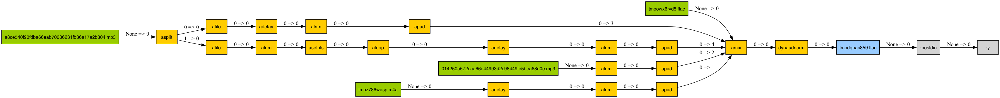

# Basic API

## Input

The basic Use `ffmpeg.input` to create a new input stream. Very Simple

```python
import ffmpeg

input_stream = ffmpeg.input('input.mp4')
```

Add Input options

```python
import ffmpeg

input_stream = ffmpeg.input('input.mp4', ss=10, t=20)
```

!!! note
    The `ss` and `t` options are used to specify the start time and duration of the input stream.
    check ffmpeg [documentation](https://ffmpeg.org/ffmpeg.html#Main-options) for details.

## Output

Use `ffmpeg.output` to create a new output stream. Very Simple

```python

import ffmpeg

ffmpeg.input("input.mp4").output(filename="output.mp4")

```

Specify Output Options

```python

import ffmpeg

(
    ffmpeg.input("input.mp4")
    .output(filename="output.mp4", ss=10, t=20)
)

```


You can also map more than one stream to the output.

```python

import ffmpeg

input1 = ffmpeg.input('input1.mp4')
input2 = ffmpeg.input('input2.mp3')

ffmpeg.output(input1, input2, filename="output.mp4")

```

or

```python

import ffmpeg
(
    ffmpeg.input('input1.mp4')
    .output(
        ffmpeg.input("input2.mp3"),
        filename="output.mp4"
    )
)
```


## Merge Output

ffmpeg can allow process multi output file at once. Typed ffmpeg also support this feature.

```python
import ffmpeg

input1 = ffmpeg.input('input1.mp4')
input2 = ffmpeg.input('input2.mp4')

output1 = input1.output(filename="output1.mp4")
output2 = input2.output(filename="output2.mp4")

ffmpeg.merge_outputs(output1, output2)

```

or

```python
import ffmpeg

(
    ffmpeg.input('input1.mp4')
    .output(filename="output1.mp4")
    .merge_outputs(
        ffmpeg.input('input2.mp4')
        .output(filename="output2.mp4")
    )
)
```


## Complex Filter

Why ffmpeg is so powerful? Because it has a powerful filter system. Typed ffmpeg also support this feature.


```python
# trim a input video and add a watermark

import ffmpeg

input_stream = ffmpeg.input('input.mp4')

(
    input_stream
    .trim(start=10, end=20)
    .drawtext(text='Hello World', fontsize=12, x=10, y=10)
    .output(filename="output.mp4")
)

```


## Multi Input

Some filter will accept multi input. In the case typed-ffmpeg will hint how many stream you need to pass with static type checking, you will need to pass excetly the same number of required input.
```python

import ffmpeg

input1 = ffmpeg.input('input1.mp4')
input2 = ffmpeg.input('input2.mp4')

(
    input1
    .overlay(input2, x=10, y=10)
    .output(filename="output.mp4")
)

```


## Multi Output

Some filter will generate multi output. In the case you will get more than one output stream. This is static type checking

```python
input1 = ffmpeg.input('input1.mp4')
input2 = ffmpeg.input('input2.mp4')

video, feedout = input1.feedback(input2)  # the feedback filter will generate two output stream

o1 = (
    video
    .drawtext(text='Hello World', fontsize=12, x=10, y=10)
    .output(filename="output1.mp4")
)

o2 = (
    feedout
    .drawtext(text='Hello World', fontsize=12, x=10, y=10)
    .output(filename="output2.mp4")
)

f = ffmpeg.merge_outputs(o1, o2)
```


## Dynamic Input

Some filter will accept dynamic input. In the case typed-ffmpeg will not able to provide typing with static typing. but you will get Exception while you create the graph, don't need to actually run ffmpeg to get the error.

to make it easier to understand, dynamic input filter can ony be used from filters module now.

```python

import ffmpeg

input1 = ffmpeg.input('input1.mp4')
input2 = ffmpeg.input('input2.mp4')

f = ffmpeg.filters.amix(input1, input2, inputs=2)

```

If the given input number is not correct, it will raise ValueError

```
import ffmpeg

input1 = ffmpeg.input('input1.mp4')
input2 = ffmpeg.input('input2.mp4')

f = ffmpeg.filters.amix(input1, input2, inputs=3)
```

```
Traceback (most recent call last):
  File "/Users/davidchen/repo/typed-ffmpeg/test.py", line 7, in <module>
    f = ffmpeg.filters.amix(input1, input2, inputs=3)
        ^^^^^^^^^^^^^^^^^^^^^^^^^^^^^^^^^^^^^^^^^^^^^
  File "/Users/davidchen/repo/typed-ffmpeg/src/ffmpeg/filters.py", line 355, in amix
    filter_node = FilterNode(
                  ^^^^^^^^^^^
  File "<string>", line 9, in __init__
  File "/Users/davidchen/repo/typed-ffmpeg/src/ffmpeg/dag/nodes.py", line 98, in __post_init__
    raise ValueError(f"Expected {len(self.input_typings)} inputs, got {len(self.inputs)}")
ValueError: Expected 3 inputs, got 2
```


## Dynamic Output

Some filter will generate dynamic output. In the case typed-ffmpeg will not able to provide typing with static typing. but you will get Exception while you create the graph, don't need to actually run ffmpeg to get the error.

```python

import ffmpeg

input1 = ffmpeg.input('input1.mp4')
split = input1.split(outputs=2)

video0 = split.video(0)
video1 = split.video(1)
video2 = split.video(2) # raise ValueError
```

```
ValueError: Specified index 2 is out of range for video outputs 2
```


ffmpeg has more than 500 filters, you can use them to do more complex things.

```python

```




## Execute

```
import ffmpeg

input_stream = ffmpeg.input('input.mp4')

f = (
    input_stream
    .trim(start=10, end=20)
    .drawtext(text='Hello World', fontsize=12, x=10, y=10)
    .output(filename="output.mp4")
)

```

### Run

```
f.run()
```

### Get Command Line

```
f.compile()
> ['ffmpeg', '-i', 'input.mp4', '-filter_complex', '[0]trim=start=10:end=20[s0];[s0]drawtext=text=Hello World:fontsize=12:x=10:y=10[s1]', '-map', '[s1]', 'output.mp4']
```


```
f.command_line()
> ffmpeg -i input.mp4 -filter_complex '[0]trim=start=10:end=20[s0];[s0]drawtext=text=Hello World:fontsize=12:x=10:y=10[s1]' -map '[s1]' output.mp4
```
mainly for debug purpose

### Visualize

```
f.view()
```


### Validate & Auto Fix

Easy to reuse graph

# Typing

## Stream Type

## Input

## Output

## Dynamic Input / Dynamic Output

## Filter Options

# Custom Filters

# Serialize
